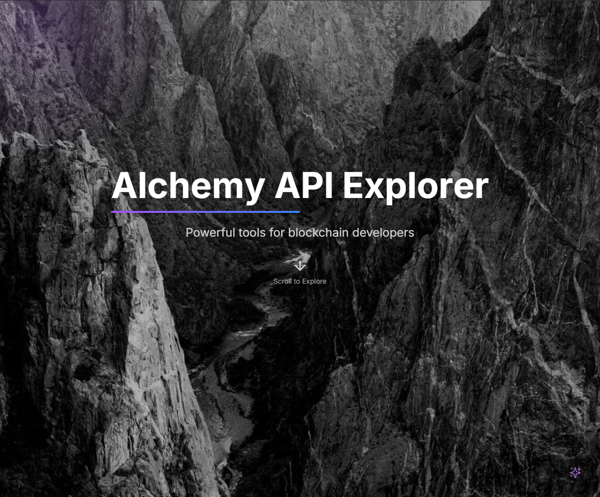
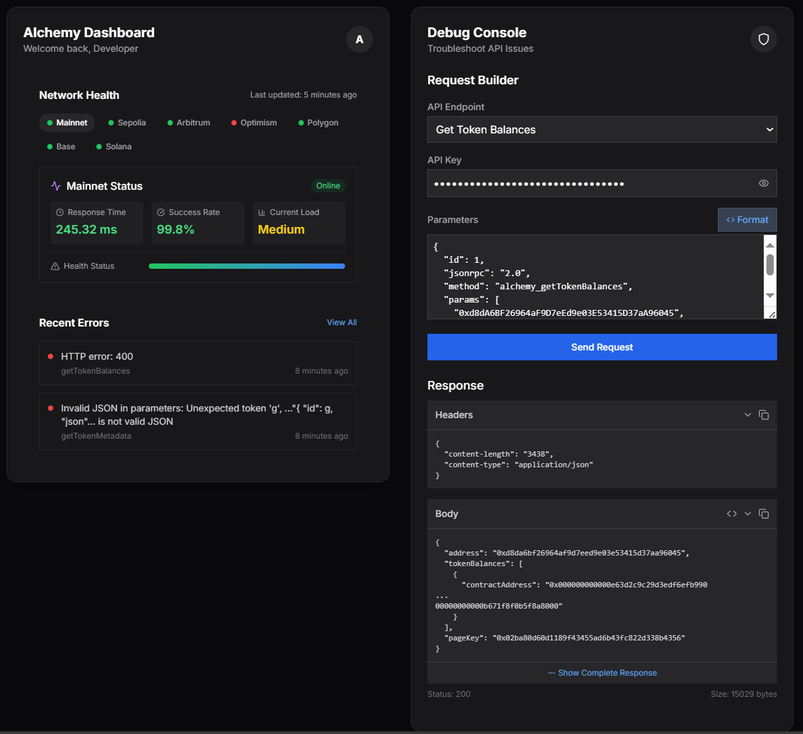
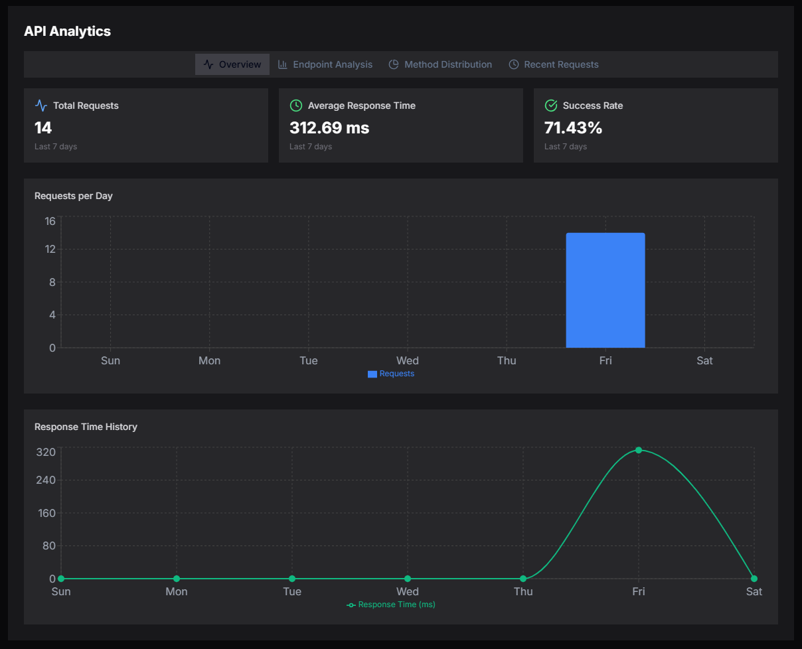
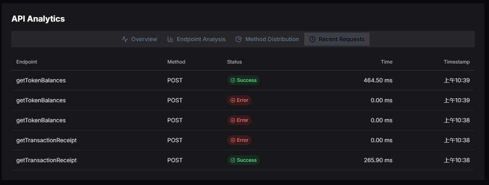

# Alchemy API Explorer

<div align="center">
  
  <p><em>Powerful tools for blockchain developers</em></p>
</div>

## Overview

Alchemy API Explorer is a comprehensive dashboard for blockchain developers to interact with, test, and monitor Alchemy's blockchain APIs. This professional-grade tool provides real-time analytics, network health monitoring, and an interactive debug console to streamline your blockchain development workflow.

## Key Features

### 🔍 Interactive API Dashboard
- Visualize API usage statistics and performance metrics
- Track request volume, response times, and success rates
- Filter analytics by endpoint, method, or time period

<div align="center">
  
</div>

### 🌐 Network Health Monitoring & 🛠️ Debug Console
- Real-time monitoring of various blockchain networks (Mainnet, Sepolia, Arbitrum, etc.)
- Performance metrics including response time, success rate, and current load
- Visual status indicators for quick assessment
- Test API endpoints with custom parameters
- Interactive request builder with parameter validation
- Detailed response viewer with formatting options
- Automatic error tracking and analysis

<div align="center">
  
</div>

### 📊 Endpoint Analysis
- Compare performance across different endpoints
- Identify bottlenecks and optimization opportunities
- Distribution visualization for request patterns

<div align="center">
  
</div>

### 📝 Request History
- View detailed history of recent API requests
- Filter by status, endpoint, or timestamp
- Quick access to request and response details

<div align="center">
  
</div>

## Getting Started

### Prerequisites

- Node.js 16.x or higher
- npm or yarn
- Basic knowledge of blockchain concepts and APIs

### Installation

1. Clone the repository
```bash
git clone https://github.com/nathan0x-XYZ/alchemy-api-dashboard.git
cd alchemy-api-dashboard
```

2. Install dependencies
```bash
cd my-app
npm install
# or
yarn install
```

3. Start the development server
```bash
npm run dev
# or
yarn dev
```

4. Open your browser and navigate to `http://localhost:3000`

## Usage Guide

### Setting Up Your API Key

1. Obtain an API key from [Alchemy's dashboard](https://dashboard.alchemy.com/)
2. Enter your API key in the Debug Console section
3. The dashboard will automatically load with your API key

### Testing API Endpoints

1. Select an endpoint from the dropdown menu in the Debug Console
2. Modify the parameters as needed (the console provides default parameters)
3. Click "Format" to ensure proper JSON formatting
4. Click "Send Request" to execute the API call
5. View the response in the Response section

### Analyzing API Performance

1. Navigate to the API Analytics tab
2. Select the desired time period and metrics
3. Use the different tabs to analyze by endpoint, method, or view recent requests
4. Hover over charts for detailed information

### Monitoring Network Health

1. Check the Network Health section for real-time status of different networks
2. Click on a specific network to view detailed metrics
3. Monitor the health status bar for overall network condition

## Project Structure

```
alchemy-api-dashboard/
├── my-app/
│   ├── public/            # Static assets
│   ├── src/
│   │   ├── app/           # Main application pages
│   │   ├── components/    # Reusable UI components
│   │   ├── services/      # API and data services
│   │   ├── layouts/       # Layout components
│   │   └── config/        # Configuration files
│   ├── package.json       # Dependencies and scripts
│   └── tsconfig.json      # TypeScript configuration
└── README.md              # Project documentation
```

## Advanced Configuration

### Environment Variables

Create a `.env.local` file in the `my-app` directory with the following variables:

```
NEXT_PUBLIC_DEFAULT_API_KEY=your_default_api_key
NEXT_PUBLIC_API_BASE_URL=https://eth-mainnet.g.alchemy.com/v2
```

### Custom Network Configuration

To add or modify networks, edit the network configuration in `src/config/networks.ts`.

## Troubleshooting

### Common Issues

- **API Key Invalid**: Ensure your API key is correctly entered and has the necessary permissions
- **Request Timeout**: Check your network connection or try a different endpoint
- **JSON Parsing Error**: Use the "Format" button to correct JSON syntax in parameters

### Error Reporting

The Recent Errors section displays the latest API errors. Click on an error for detailed information to help diagnose and resolve issues.

## Technologies Used

- **Next.js**: React framework for server-rendered applications
- **React**: JavaScript library for building user interfaces
- **TypeScript**: Typed superset of JavaScript
- **Tailwind CSS**: Utility-first CSS framework
- **Framer Motion**: Animation library for React
- **Chart.js**: JavaScript charting library

## Contributing

We welcome contributions to improve the Alchemy API Explorer! Please follow these steps:

1. Fork the repository
2. Create a feature branch (`git checkout -b feature/amazing-feature`)
3. Commit your changes (`git commit -m 'Add amazing feature'`)
4. Push to the branch (`git push origin feature/amazing-feature`)
5. Open a Pull Request

## License

This project is licensed under the MIT License - see the LICENSE file for details.

## Acknowledgements

- [Alchemy](https://www.alchemy.com/) for providing the blockchain infrastructure
- All contributors who have helped improve this dashboard
